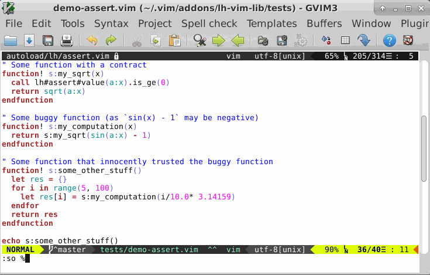

# Design by Contract functions

## Presentation
This set of functions introduces DbC helpers. There are here to help plugin
developers to detect and eradicate Vim Scripting programming errors.

When an assertion fails, we cannot expect the script to go on correctly. There
IS an error in its logic. We cannot expect anything good after that. That's
where `lh#assert#*()` functions differs from Vim
[|test-functions|](http://vimhelp.appspot.com/usr_41.txt.html#test-functions)
and my [vim-UT](http://github.com/LucHermitte/vim-UT) plugin: these other
functions aim at providing tools to write unit tests.

## DbC in action
Here is a little demo to see what we can do with this framework.

The screencast has been done on the following code:

```vim
" Some function with a contract
function! s:my_sqrt(x)
  call lh#assert#value(a:x).is_ge(0)
  return sqrt(a:x)
endfunction

" Some buggy function (as `sin(x) - 1` may be negative)
function! s:my_computation(x)
  return s:my_sqrt(sin(a:x) - 1)
  " return s:my_sqrt(1-sin(a:x))
endfunction

" Some function that innocently trusted the buggy function
function! s:some_other_stuff()
  let res = {}
  for i in range(0, 100)
    let res[i] = s:my_computation(i/10* 3.14159)
  endfor
  return res
endfunction

echo s:some_other_stuff()
```



Note: In order to always display the correct parameters received, you'll need
Vim 8.0-287. See [Vim Issue #1352](http://github.com/vim/vim/issues/1352).

## Function list

| Function                       | Purpose                                                                                                                                           |
|:-------------------------------|:--------------------------------------------------------------------------------------------------------------------------------------------------|
| `lh#assert#mode()`             | Sets the assertion mode (default, `'debug'`, `'ignore'`, `'stop'`) -- can be toggled with `:Toggle PluginAssertmode [{value}]`                    |
| `lh#assert#clear()`            | Clears the last known contract failures                                                                                                           |
| `lh#assert#empty()`            | Asserts a value is empty                                                                                                                          |
| `lh#assert#equal()`            | Asserts a value equals to what is expected                                                                                                        |
| `lh#assert#errors()`           | Returns the last known contract failures -- meant to be fed directly to [`setqflist()`](http://vimhelp.appspot.com/eval.txt.html#setqflist%28%29) |
| `lh#assert#false()`            | Asserts a value is false                                                                                                                          |
| `lh#assert#if().then_expect()` | Asserts condition1 implies condition2                                                                                                             |
| `lh#assert#is()`               | Asserts two entities are the same                                                                                                                 |
| `lh#assert#is_not()`           | Asserts two entities are not the same                                                                                                             |
| `lh#assert#match()`            | Asserts a pattern matches a value                                                                                                                 |
| `lh#assert#not_empty()`        | Asserts a value is not empty                                                                                                                      |
| `lh#assert#not_equal()`        | Asserts a value differs from a reference value                                                                                                    |
| `lh#assert#true()`             | Asserts a value is true                                                                                                                           |
| `lh#assert#unexpected()`       | Signals an unexpected situation                                                                                                                   |
| `lh#assert#value().equal()`    | Asserts actual == ref                                                                                                                             |
| `lh#assert#value().differ()`   | Asserts actual != ref                                                                                                                             |
| `lh#assert#value().is_le()`    | Asserts actual <= ref                                                                                                                             |
| `lh#assert#value().is_lt()`    | Asserts actual <  ref                                                                                                                             |
| `lh#assert#value().is_ge()`    | Asserts actual >= ref                                                                                                                             |
| `lh#assert#value().is_gt()`    | Asserts actual >  ref                                                                                                                             |
| `lh#assert#value().is_set()`   | Asserts `lh#option#is_set(actual)`                                                                                                                |
| `lh#assert#value().is_unset()` | Asserts `lh#option#is_unset(actual)`                                                                                                              |
| `lh#assert#value().empty()`    | Asserts `empty(actual)`                                                                                                                           |
| `lh#assert#value().has_key()`  | Asserts `has_key(actual, key)`                                                                                                                    |
| `lh#assert#value().get()`      | Permits to assert on the element at key/index position in the actual dict/list                                                                    |
| `lh#assert#value().match()`    | Asserts `actual =~ pattern`                                                                                                                       |
| `lh#assert#value().verifies()` | Asserts the predicate passed evaluates to true with the specified parameters                                                                      |
| `lh#assert#value().not()`      | Inverses the logic of the next assertions                                                                                                         |
| `lh#assert#type().is()`        | Asserts the type of the expression is as expected                                                                                                 |
| `lh#assert#type().belongs_to()`| Asserts the type of the expression belongs to the list of data passed                                                                             |
| `lh#assert#type().not()`       | Inverses the logic of the next assertions                                                                                                         |


See [`:h lhvl#DbC`](lh-vim-lib.txt) for more information on the topic.

## Caveats

 * Unlike C or Python assertions, the assertions provided in this framework
   cannot be completely neutralized. That means a few objects and a test will always be
   created/done -- even with after a `:call lh#assert#mode('ignore')` with
   `lh#assert#equals()` & co. However, in _ignore_ mode, tests are
   short-circuited with `lh#assert#value()` and `lh#assert#type()`.
 * Don't use assertions from a
   [channel-callback](http://vimhelp.appspot.com/channel.txt.html#channel%2dcallback)
   nor from a
   [job-callback](http://vimhelp.appspot.com/channel.txt.html#job%2dcallback).
   Indeed, you'll see your callback being called again and again while
   interacting with the DbC framework.

## TO DO list

 * As we have a `lh#assert#value().not()`, define a `lh#assert#value().job()`
   that'll remove the _default_ interacting mode and the `'debug'` mode.
