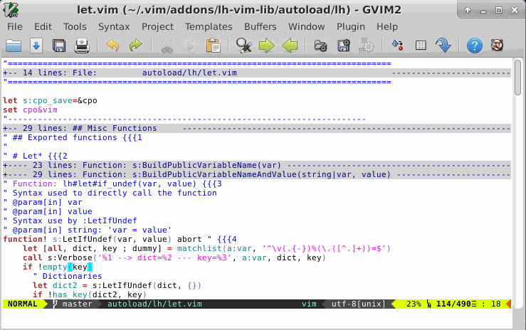

# Logging Framework

## Description

lh-vim-lib provides a global logger since version 3.6.0.

By default, it'll echo everything with `:echomsg` (through `lh#log#echomsg`).

The logging policy can be set thanks to `lh#log#set_logger()`.
In plugins, logging can be done directly thanks to `lh#log#this()`, or though
an encapsulation, see below.

This logger doesn't support log level directly. Instead, the recommended way to
use it is to have logging helper functions in each plugins (autoload plugins,
or plain plugins, ftplugins, ...)  and to have these functions test a plugin
related verbose option to decide whether they log anything or not.
I use [mu-template](http://github.com/LucHermitte/mu-template) skeletons for
vim plugins to automatically define these
functions in my plugins.

## Usage

### ...from (autoload-)plugins

It looks like this:

```vim
" # Debug
let s:verbose = get(s:, 'verbose', 0)
function! lh#icomplete#verbose(...)
  if a:0 > 0
    let s:verbose = a:1
  endif
  return s:verbose
endfunction

function! s:Log(...)
  call call('lh#log#this', a:000)
endfunction

function! s:Verbose(...)
  if s:verbose
    call call('s:Log', a:000)
  endif
endfunction
```

### ...when we want to see the traces

Thus, if I want to trace what is done in my icomplete autoload plugin, I call

```vim
:call lh#icomplete#verbose(1)
" or If plugin/vim_maintain.vim from lh-misc is installed:
:Verbose icomplete
```

If I want to disable completely all logs, I can execute:

```vim
:call lh#log#set_logger('none')
```

If I prefer to see my traces on the right side, and in a
[|quickfix-window|](http://vimhelp.appspot.com/quickfix.txt.html#quickfix-window)
in order to trace the files + line numbers along with the message to log, I'll
execute

```vim
:call lh#log#set_logger('qf', 'vert')
```

## Screencast



## Functions:

| Function                           | Purpose                                                                        |
|------------------------------------|--------------------------------------------------------------------------------|
| `lh#log#echomsg()`                 | Returns a new logger object, that logs with `:echomsg` (internal use)          |
| `lh#log#new()`                     | Returns a new logger object (internal use)                                     |
| `lh#log#none()`                    | Returns a new, inactive, logger object (internal use)                          |
| `lh#log#set_logger(kind, opts)`    | Sets the global logging policy (quickfix/loclist window, none, `echomsg`)      |
| `lh#log#this({format}, {args...})` | Logs a formatted message with the global logger                                |
| `lh#log#exception(...)`            | Logs the exception, and possibly its call stack, with the global logger.       |


## Design considerations

### Logging context, i18n...
This framework has a feature that isn't that trivial to implement: it locates
the lines (file + line number) from where every log message is issued.

It isn't used by all logging policies, it's used only by those that fill the
quickfix window (or location list windows) in order to permit to navigate the
context of the logged messages, as you can see in the screencast.


It's ain't trivial because:

- we need a hack to ask Vim the current context we are in (callstack)
- Vim returns context information in the current locale

In neither case Vim provides anything to directly obtain the
[information we are looking for](https://github.com/vim/vim/issues/1125). In
the end, everything is taken care of by lh-vim-lib
[callstack decoding API](Callstack.md) -- which has other applications.

Also, please note that decoding the callstack is really slow and that this
shall be avoided in loops.

### Logging levels
Usually logging frameworks provide logging levels. This logging framework does
not, and it's not really an issue.


#### TL;DR
The choices I've made in lh-vim-lib and my other plugins are the following:
- Information messages are meant to be always displayed.
- Error messages are meant to be always displayed, and to stop the current
  process. If they don't need to stop the current process, it means they are
  just warnings that can be seen as colored information messages.
- We can activate debug messages independently in each module.
- I don't really care about the execution context of an information message,
  this means information messages must be clear and explicitly about what they
  saying.
- When debugging I need the logging context of a debug message.
- We need to be able to trace back the context of an error, whether it's a
  runtime error or a logic error.

#### Rationale/motivations
End users only really need comprehensible error and information messages. They
don't care about the context. They don't care about debug messages.

Also, Vim already provides:

- [`:echo`](http://vimhelp.appspot.com/eval.txt.html#%3aecho) and
  [`:echomsg`](http://vimhelp.appspot.com/eval.txt.html#%3aechomsg) for
  information messages ;
- [`:echoerr`](http://vimhelp.appspot.com/eval.txt.html#%3aechoerr) or
  [`:throw`](http://vimhelp.appspot.com/eval.txt.html#%3athrow) for error
  messages.

lh-vim-lib also provides `lh#common#warning_msg()`, `lh#common#error_msg()`,
and `lh#common#echomsg_multilines()` that add some colors to the messages.

If we want to report programming errors, lh-vim-lib provides a [DbC](Dbc.md)
framework -- that can fill the quickfix window with error context, or initiate
a debugging session from the failed assertion.

Do we really need to be able to decode the context for error and information
messages? I'm not so sure. That's why I don't provide anything like
`lh#log#{info,error,debug}()`. Yet, if we really need to, we just have to call
directly `lh#log#this()`. Regarding errors, if we fail with `:errorerr` or
`:throw`, we can decode the error message with
[`:call lh#exception#say_what()`](Callstack.md#lhexceptionsay_what).

When I debug a feature I'm working on, I don't care about what happens in
another plugin that is used along the way. This means I want to chose which
module is in verbose mode, and which module shall remain silent. In the end, a
_module_ is an autoload plugin. With a `lh#log#debug()` function, I'd need to
pass around the name of the module. With a `s:Verbose()` function, I need
instead to duplicate 30ish lines in all my autoload plugins.

Note BTW that we mustn't and don't need to comment and uncomment debugging
lines depending on whether we are working on a feature, or releasing a plugin.
